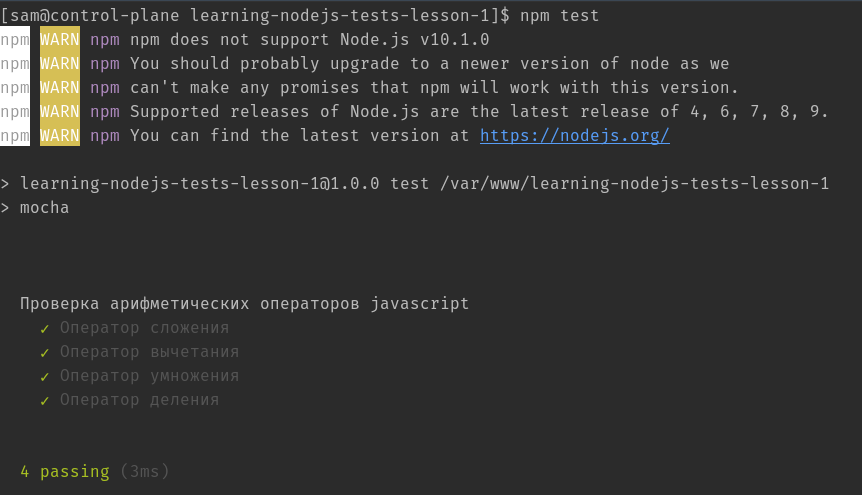

# Урок первый #

## Установка node.js и npm ##

На ОС Fedora и CentOS установить node.js и npm можно следующей командой. Для старта нас устроит любая версия.

```bash
yum install nodejs nodejs-npm
```

## Установка необходимых модулей ##

Все команды необходимо выполнять в любой удобной папке с [правами на запись](https://ru.wikipedia.org/wiki/Chmod) для вашего пользователя. Например **/home/username/lesson1**.

Для запуска простого теста нам понадобятся два модуля: [mocha](https://mochajs.org/) и [chai](https://www.chaijs.com/). Они являются довольно популярными и доступными для понимания.
Первый из них - это фреймворк для запуска тестов и генерации отчетов, а второй - набор инструментов для тестирования.
Установить их можно командой:

```bash
npm i mocha chai
```

**npm** - подпрограмма, которая устанавливает/удаляет дополнительные модули для node.js

После этого в директории проекта появится папка **node_modules**. Ее содержимое можно посмотреть командой:

```bash
ls node_modules
```

**ls** - стандартная подпрограмма linux. Ее задача показывать список директорий и файлов.

Также можно воспользоваться **npm** для отображения списка установленных пакетов:

```bash
npm list
```

Результат будет построен в виде дерева зависимостей, и мы увидим, что установив лишь два модуля,
по их зависимостям установилось еще довольно много различных модулей.

Если нас интересует какой-то конкретный модуль и его версия мы можем глянуть это следующим образом:

```bash
npm list mocha
```

Теперь для полноценного завершения работы по инициализации проекта, необходимо выполнить команду:

```bash
npm init
```

И ответить на парочку вопросов. Можно просто жать ```Enter```, тогда все значения будут установлены по умолчанию.

В итоге, содержимое ```package.json``` должно иметь примерно следующий вид:

```json
{
  "name": "learning-nodejs-tests-lesson-1",
  "version": "1.0.0",
  "description": "## Установка node.js ##",
  "main": "index.js",
  "dependencies": {
    "chai": "^4.2.0"
  },
  "devDependencies": {
    "mocha": "^7.1.2"
  },
  "scripts": {
    "test": "mocha"
  },
  "repository": {
    "type": "git",
    "url": "https://gitlab.decluster.ria.com/bu-auto-qa/learning/nodejs-tests/lesson-1"
  },
  "author": "",
  "license": "ISC"
}
```

## Первый тест ##

Для того, чтоб всё выглядело прилично, нам понадобится папка **test**, где мы будем складировать наши тесты:

```bash
mkdir test
```

В этой папке создадим файл ```index.js```:

```bash
touch test/index.js
```

Почему ```index.js```? - Менеджер пакетов в node.js работает таким образом, что когда мы затребуем папку с файлами в которых
содержатся тесты, первым будет считываться файл с названием ```index.js```. Подробнее можно почитать в п.1 списка литературы.

Теперь можно начинать. Мы напишем простейший тест, который проверит как работают базовые арифметические операторы в javascript.
Добавим в файл ```index.js``` следующие строки:

```javascript
const chai = require("chai"),
  expect = chai.expect;
```

Мы объявили две переменные **chai** и **expect**, из которых в последнюю будет записана ссылка на свойство **expect**
объекта **chai**.

Дальше нам необходимо написать сам тест:

```javascript
describe('Проверка арифметических операторов javascript', function(){
   it('Оператор сложения', function(){
      return expect(2+2).to.be.equal(4);
   });
   it('Оператор вычитания', function(){
      return expect(4-2).to.be.equal(2);
   });
   it('Оператор умножения', function(){
      return expect(2*2).to.be.equal(4);
   });
   it('Оператор деления', function(){
      return expect(4/2).to.be.equal(2);
   })
});
```

Итоговое содержимое файла ```test/index.js```:

```javascript
const chai = require("chai"),
			expect = chai.expect;

describe('Проверка арифметических операторов javascript', function(){
	it('Оператор сложения', function(){
		return expect(2+2).to.be.equal(4);
	});
	it('Оператор вычетания', function(){
		return expect(4-2).to.be.equal(2);
	});
	it('Оператор умножения', function(){
		return expect(2*2).to.be.equal(4);
	});
	it('Оператор деления', function(){
		return expect(4/2).to.be.equal(2);
	})
});
```

После этого запустим:

```bash
npm test
```

Если все хорошо, то мы увидим отчет о тестировании, где зелеными галочками отмечены успешно пройденные тесты:



Как **npm** узнал что надо запустить именно наш тест? Ответ находится в файле ```package.json```:

```json
  "scripts": {
    "test": "mocha"
  }
```

В свойстве **scripts** этого файла перечислены все возможные команды. Отсюда мы узнали что для команды **test**
(она стандартная и поэтому не требуется добавления слова **run**) прописан вызов нашего фреймворка для тестирования - **mocha**,
который, в свою очередь, при вызове заглядывает в папку **test** нашего проекта, где находит файл ```index.js```, а
в нем мы предусмотрительно написали свои тесты.

## Что мы узнали? ##

1. Как установить **nodejs** и **npm**
2. Как пользоваться **ls** и **npm** для просмотра файлов в папке **node_modules**
3. Как инициализировать наш проект для полноценной работы
4. Как написать простой тест проверящий арифметические операторы
5. Как запустить наш тест

## Список литературы ##

1. [What is require?](https://nodejs.org/en/knowledge/getting-started/what-is-require/)